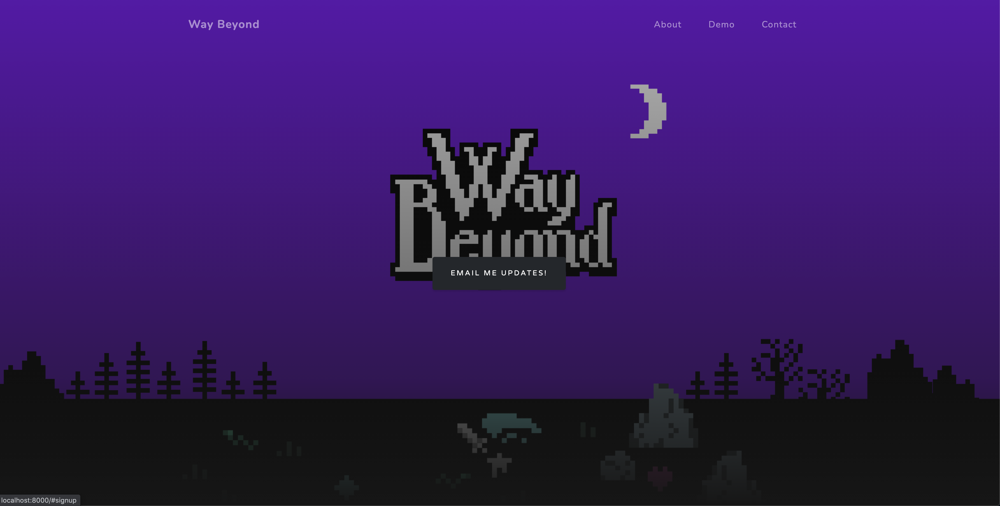

# Way Beyond UI Template

**For Bálint**
You will need to add your mailchimp endpoint to the below file:
gatsby-config.js

here's the instructions 
https://thetrevorharmon.com/blog/email-signup-forms-with-gatsby-and-mailchimp

email me with any questions: :)
programtanner@gmail.com

## Screenshot



## Install

Make sure that you have the Gatsby CLI program installed:

```sh
npm install --global gatsby-cli
```

And run from your CLI:

```sh
gatsby new <site-name> https://github.com/anubhavsrivastava/gatsby-starter-grayscale
```

Then you can run it by:

```sh
cd gatsby-example-site
npm install
gatsby develop
```

### Personalization

Edit `config.js` to put up your details

```javascript
module.exports = {
  siteTitle: 'Gatsby Starter grayscale', // <title>
  ...
  heading: 'Anubhav Srivastava',
  subHeading: 'Full time Web Developer. Part time Open source contributor  ',

  // social
  socialLinks: [
    {
      icon: 'fa-github',
      name: 'Github',
      url: 'https://github.com/anubhavsrivastava',
    }
    ...
  ],
};

```

### License

[](LICENSE)

refer `LICENSE` file in this repository.
# WayBeyondUI
